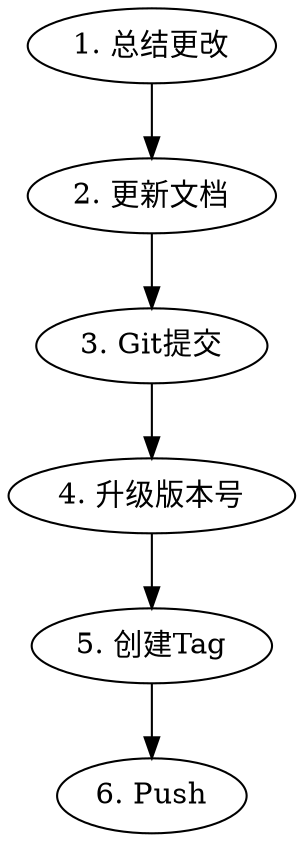

# 版本发布

## 概述

claude-code-tool 项目的版本发布流程，包含文档更新、版本升级、打标签和推送。

## 发布流程



## 步骤详解

### 1. 总结当前更改
```bash
git log <上个tag>..HEAD --oneline
```
- 查看自上次发布以来的所有提交
- 归纳主要改动点（新功能、修复、重构等）

### 2. 更新文档
- **CHANGELOG.md**：添加新版本号、日期和变更说明
- **README.md**：如有新功能或用法变更需同步更新

### 3. Git 提交
```bash
git add .
git commit -m "chore: bump version to x.x.x"
```

### 4. 升级版本号
- 修改 `Cargo.toml` 中的 `version` 字段
- 执行 `cargo build` 确认 `Cargo.lock` 同步更新

### 5. 创建 Tag
```bash
git tag v<x.x.x>
```
- 格式：`v` + 版本号（如 `v0.1.6`）
- Tag 会触发 GitHub Actions 自动构建发布

### 6. Push
```bash
git push && git push --tags
```

## 注意事项

- 版本号遵循语义化版本（SemVer）：MAJOR.MINOR.PATCH
- 确保所有测试通过后再发布
- Tag 创建后 GitHub Actions 会自动执行发布流程
