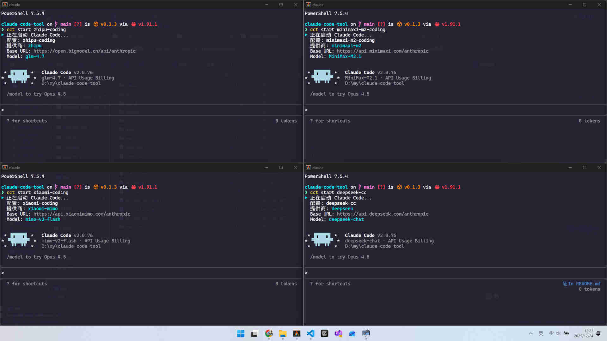

# 🛠️ claude-code-tool (cct)

[English](README.md) | **中文**

[](https://github.com/punisher1/claude-code-tool/releases)

[](https://github.com/punisher1/claude-code-tool/releases)
[](LICENSE)

Claude Code API 切换工具 - 轻松管理并即时切换多个 API 提供商。支持同时开启多个终端 Session，并为每个 Session 配置不同的提供商（例如：在一个终端用 DeepSeek，另一个终端用 Kimi）。



## 📋 目录
- [🛠️ claude-code-tool (cct)](#️-claude-code-tool-cct)
  - [📋 目录](#-目录)
  - [🌟 功能](#-功能)
  - [📥 安装](#-安装)
    - [从 GitHub Release 下载（推荐）](#从-github-release-下载推荐)
    - [从源码构建](#从源码构建)
  - [🚀 使用方法](#-使用方法)
    - [列出所有提供商](#列出所有提供商)
    - [添加自定义提供商](#添加自定义提供商)
    - [删除自定义提供商](#删除自定义提供商)
    - [添加 API 配置](#添加-api-配置)
    - [使用配置](#使用配置)
    - [运行 Claude Code](#运行-claude-code)
  - [📂 文件位置](#-文件位置)
  - [🔌 支持的提供商](#-支持的提供商)
    - [内置提供商](#内置提供商)
    - [自定义提供商](#自定义提供商)
  - [⚙️ 技术特性](#️-技术特性)
    - [环境变量类型支持](#环境变量类型支持)
  - [👨‍💻 开发](#-开发)
    - [运行测试](#运行测试)
    - [开发构建](#开发构建)
    - [发布构建](#发布构建)
    - [创建 Release](#创建-release)
    - [代码格式化](#代码格式化)
    - [代码检查](#代码检查)
  - [📄 许可证](#-许可证)


## 🌟 功能

- **多 Session 支持**：支持同时开启多个终端窗口，并为每个窗口运行配置了不同提供商的 Claude Code。
- **多提供商支持**：轻松切换 Anthropic 官方 API 和第三方兼容提供商（DeepSeek、Kimi/Moonshot、智谱 GLM 等）
- **自定义提供商**：添加和管理自定义 API 提供商
- **配置管理**：创建和管理多个 API 配置实例
- **一键切换**：快速激活不同的 API 配置
- **启动运行**：直接启动 Claude Code 并设置指定配置的环境变量

## 📥 安装

### 一键安装（推荐）

**Linux / macOS:**
```bash
curl -fsSL https://raw.githubusercontent.com/punisher1/claude-code-tool/main/install.sh | bash
```

**Windows (PowerShell):**
```powershell
irm https://raw.githubusercontent.com/punisher1/claude-code-tool/main/install.ps1 | iex
```

**安装指定版本:**
```bash
# Linux / macOS
curl -fsSL https://raw.githubusercontent.com/punisher1/claude-code-tool/main/install.sh | bash -s -- --version 0.1.5
```
```powershell
# Windows
.\install.ps1 -Version 0.1.5
```

**使用代理安装:**
```bash
# Linux / macOS
curl -fsSL https://raw.githubusercontent.com/punisher1/claude-code-tool/main/install.sh | bash -s -- --proxy http://127.0.0.1:11224
```
```powershell
# Windows
.\install.ps1 -Proxy http://127.0.0.1:11224
```

### 从 GitHub Release 下载
访问 [Releases 页面](https://github.com/punisher1/claude-code-tool/releases) 下载适合您平台的预编译二进制文件：

- **Linux x86_64**: `cct-Linux-x86_64.tar.gz`
- **macOS x86_64**: `cct-Darwin-x86_64.tar.gz`
- **macOS Apple Silicon**: `cct-Darwin-aarch64.tar.gz`
- **Windows x86_64**: `cct-Windows-x86_64.zip`

下载后解压并将二进制文件添加到系统 PATH。

### 从源码构建

确保已安装 Rust 工具链（1.70+），然后运行：

```bash
# 克隆仓库
git clone https://github.com/punisher1/claude-code-tool.git
cd claude-code-tool

# 构建发布版本
cargo build --release
```

可执行文件将生成在 `target/release/cct` (Windows 上为 `cct.exe`)

## 🚀 使用方法

### 列出所有提供商
```bash
cct provider list
```

### 添加自定义提供商
```bash
cct provider add [name]
# 或使用交互模式
cct provider add
```

### 删除自定义提供商
```bash
cct provider rm <name>
```

### 导出内置提供商
```bash
# 导出所有内置提供商到 ~/.cct/providers.toml
cct provider init
```
这将创建一个 `providers.toml` 文件，你可以编辑它来自定义提供商配置。

### 添加 API 配置
```bash
cct add -p <provider> -a <api_key> <alias>
# 例如
cct add -p deepseek -a sk-xxx my-deepseek
```

### 使用配置
```bash
cct use <alias>
# 例如
cct use my-deepseek
```

### 运行 Claude Code
```bash
# 使用当前配置运行 Claude Code
cct run

# 使用指定配置运行 Claude Code
cct run [alias]
# 例如
cct run my-deepseek

# 运行并传递参数给 claude
cct run my-deepseek -- -p "hello claude"

# 运行并设置代理
cct run my-deepseek --proxy "http://127.0.0.1:11225"
```

## 📂 文件位置

- 配置文件：`~/.cct/config.toml` (macOS/Linux) 或 `%USERPROFILE%\.cct\config.toml` (Windows)
- 提供商文件：`~/.cct/providers.toml`（可选，用于自定义提供商）
- Claude 设置：`~/.claude/settings.json` (macOS/Linux) 或 `%USERPROFILE%\.claude\settings.json` (Windows)

## 🔌 支持的提供商

### 内置提供商
- **claude-code** - Anthropic Claude Code (官方版)
- **deepseek** - DeepSeek API
- **kimi-coding** - Kimi for Coding (Moonshot API)
- **zhipu** - 智谱 GLM API
- **xiaomi-mimo** - 小米 Mimo Coding
- **minimaxi-m2** - Minimax M2 Coding

### 自定义提供商
支持添加任何兼容 Anthropic API 格式的第三方提供商。

## ⚙️ 技术特性

### 环境变量类型支持
配置文件中的环境变量支持三种类型：
- **字符串 (String)**: 适用于 URL、API 密钥等文本值
- **整数 (Int)**: 适用于数值类型的配置，如超时时间、标志位等
- **布尔值 (Bool)**: 适用于 true/false 配置选项

示例配置：
```toml
[providers.deepseek]
description = "DeepSeek API"
env.ANTHROPIC_BASE_URL = "https://api.deepseek.com"
env.ANTHROPIC_MODEL = "deepseek-chat"
env.API_TIMEOUT_MS = 3000000  # 整数类型
env.CLAUDE_CODE_DISABLE_NONESSENTIAL_TRAFFIC = 1  # 整数标志位
```

## 👨‍💻 开发

### 运行测试
```bash
cargo test
```

### 开发构建
```bash
cargo build
```

### 发布构建
```bash
cargo build --release
```

### 创建 Release

项目使用 GitHub Actions 自动化 release 流程。创建新版本：

1. **创建并推送标签**:
   ```bash
   git tag v0.1.0
   git push origin v0.1.0
   ```

2. **GitHub Actions 自动执行**:
   - 为 Linux、macOS、Windows 构建二进制文件
   - 创建 GitHub Release
   - 自动生成 Release Notes
   - 上传所有平台的二进制文件和 checksum

3. **在 GitHub Release 页面查看结果**:
   - 自动生成的 Release Notes（基于 commit 分类）
   - 所有平台的预编译二进制文件
   - 每个二进制文件的 SHA256 checksum

release workflow 配置在 `.github/workflows/release.yml`。

### 代码格式化
```bash
cargo fmt
```

### 代码检查
```bash
cargo clippy
```

## 📄 许可证

MIT License
